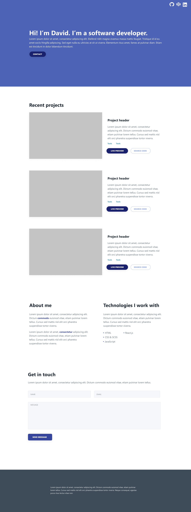

# My personal website
First iteration of my website, used to showcase my most recent work. You can visit the website at [Not a live url](http://google.com).
## Built using
I created the website using HTML/SCSS and plain JavaScript. In addition to that I also used:
* Normalize.css - as a base for my own reset.
* Fontawesome - for the icons.
* Figma - where I created my mockup.
## Goals with this project
My goal was to create a website that is modern and simplistic. While I could have added additional features just for the sake of it. I felt that it might ultimately take away from the projects that I am trying to showcase in the first place. After all: 
>"Simplicity is the ultimate sophistication." - Leonardo da Vinci

### Initial idea
This was the initial design that I created in Figma before I started building the project.

